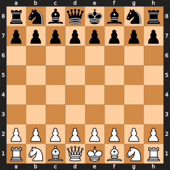

# AI Assignment 3 - Spring 2025

## Objective
Implement classical adversarial search algorithms — Minimax and Alpha-Beta Pruning — in the Chess environment. The goal is to compare their performance based on decision quality, execution time, and depth of search (k-ply trees), and visualize the strategies in action.

## Algorithms Implemented
- Minimax
- Alpha-Beta Pruning
- Minimax with K-ply
- Alpha-Beta Pruning with K-ply
- Comparision Minimax vs AlphaBeta in 3-ply search


## Installation

1. Download and install the following tools:
   - [Visual Studio Code (for Windows)](https://code.visualstudio.com/Download)
   - [Anaconda (for Windows)](https://www.anaconda.com/download)

2. Open **Anaconda Prompt** and enter the following commands sequentially:

    ```bash
    conda create -n chessenv python=3.10 anaconda
    conda activate chessenv


3. Download this repository as a ZIP folder.

4. Extract the ZIP file in your working directory.

5. Navigate to the extracted folder and open it in VS Code:

    ```bash
    cd CS514_Assignment_3
    code .
    ```

6. In VS Code, select the Python interpreter associated with the Conda environment `chessenv`.

7. Change Stockfish path
  ```bash
  STOCKFISH_PATH = "/path/to/your/stockfish"  #update this path and run
  ```
> **Note**: Since the evaluation function is outsourced to Stockfish, this assignment purely benchmarks the efficiency of search algorithms rather than hand-crafted evaluation logic.


8. Finally, install all dependencies using the provided Bash script:

    ```bash
    pip install python-chess matplotlib cairosvg
    ```


## Environment Used

This project is built around a chess-playing environment using the python-chess library, which simulates a virtual chessboard and manages legal move generation, board states, and game outcomes. It integrates with the powerful Stockfish engine to evaluate positions and guide decision-making for AI algorithms like Minimax and Alpha-Beta pruning.

## Evaluation Function Used
- In this chess environment, the evaluation function is powered by the Stockfish chess engine, a highly sophisticated and widely used open-source engine.


   ```python
   def evaluate_board(board, time_limit=0.1):
     result = engine.analyse(board, chess.engine.Limit(time=time_limit))
     return result['score'].white().score(mate_score=10000)
  ```
- This function: Uses Stockfish to analyze a board state with a time constraint (default: 0.1 seconds).
- Returns a numerical score that represents the advantage from White's perspective.  
- Handles forced mates by assigning high positive/negative scores (e.g., 10000).

## Why This Works for Both Algorithms:
Both Minimax and Alpha-Beta Pruning are tree-search algorithms that rely on numeric evaluations of terminal or leaf nodes to backpropagate values up the game tree.
Minimax uses this score to choose the move with the best worst-case outcome.
Alpha-Beta does the same but more efficiently by pruning unnecessary branches—still relying on the same evaluation function to assess board positions.

## Performance Evaluation

| Algorithm | Environment   | Computation Time  | Evaluation to root | Best Move| Board|
|-----------|---------------|------------------|--------|----------------------|------------------------------|
| MINIMAX      | Chess  |    199.17 seconds          |   66  | c1f4 | minimax_board.svg |
| AlphaBetaPruning     | Chess  | 199.14 seconds            |  0   | c1f4           | alphabeta_pruning_board.svg |


| Algorithm | Environment   | Computation  Time  | Depth | Best Move | Evaluation | Board |
|-----------|---------------|-----------------------|--------|---------------|------|------------------------------|
| MINIMAX with K-Ply        | Chess          | 9.86 s             |  2   | c1f4        | 48 | Minimax_K_ply_board.svg |
| AlphaBetaPruning  with K-Ply  | Chess    | 0.88 s       | 2          |  c1f4   | 26 |     aplhaBeta_K_ply_board.svg      |


## Demo Gifs

<div align="center">


<table>
  <tr>
    <td align="center">
      <strong>Game Play</strong><br>
      
    </td>
    
  </tr>
</table>

</div>

## Key Observations

- Alpha-Beta Pruning significantly reduces the average decision time without affecting the final move decision quality.
- Full-depth Minimax shows an evaluation score of 66, while Alpha-Beta shows 0.
- Stockfish evaluation ensures robust decision-making even for shallow depths.
- Visualization via `.svg` boards helped verify and understand move quality.


## Directory Structure
```bash
.
├── Assignment_3_ CS514.pptx
├── assignment3_fair.ipynb   
│── alphaBeta_board.svg
│── alphaBeta_k_ply_board.svg
│── game.gif
│── minimax_board.svg
├── Minimax_K_ply_board.svg
├── README.md
└── frames
    ├── move_001.png
    ├── move_002.png
    ├── move_003.png
    ├── move_004.png
    ├── move_005.png
    ├── move_006.png
    ├── .
        .
        .
        .
    └── move_107.png
    └── move_108.png
```


## References

- [python-chess Documentation](https://python-chess.readthedocs.io/)
- [Stockfish GitHub](https://github.com/official-stockfish/Stockfish)
- [Minimax and Alpha-Beta Wikipedia](https://en.wikipedia.org/wiki/Minimax)

--------------------------------------------------------


